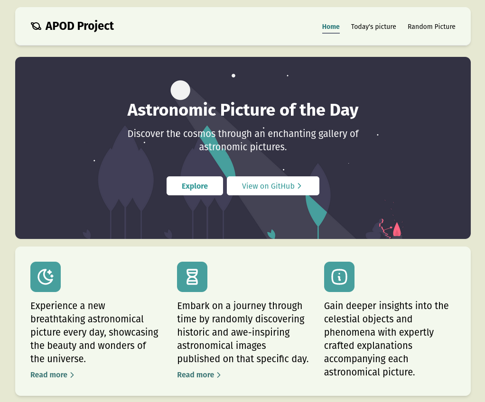

# Astronomic Picture of the Day Project



The Astronomic Picture of the Day (APOD) Project is a website that displays a
new astronomical picture with its description daily. Additionally, the website
has a section "Random Picture" that randomly picks a date and displays an
astronomical image that was published on that specific day.

## Table of Contents

- [About](#about)
- [Demo](#demo)
- [Installation](#installation)
- [Usage](#usage)
- [API](#api)
- [License](#license)

## About

The Astronomic Picture of the Day project is built using TypeScript, Deno, and
the Fresh Framework. It leverages data from
[NASA's Astronomy Picture of the Day API](https://github.com/nasa/apod-api),
which is ported to Deno and hosted on [Deno Deploy](https://deno.com/deploy) in
the following repository: [APOD API](https://github.com/johfee/apod-api). With
this project, users can explore stunning astronomical images captured by NASA
and learn about the wonders of the cosmos.

## Live website

You can find a live demo of the website at [https://apod-project.deno.dev/](https://apod-project.deno.dev/)

## Installation

Make sure to install Deno: https://deno.land/manual/getting_started/installation

Then start the project:

```
git clone https://github.com/johfee/apod-project.git
cd apod-project
```

Then run the project:

```
deno task start
```

This will watch the project directory and restart as necessary.

## Usage

Once the project is running, you can access it through your web browser at
http://localhost:8000.

The "Today's Picture" page will display the latest astronomical picture along
with its description.

To explore images from random dates, navigate to the "Random Picture" page,
where you will be displayed a random astronomical picture from a random date.

## API

This project relies on the APOD API hosted on
[GitHub](https://github.com/johfee/apod-api). For more details about the API and
usage, refer to the Github repo.

## License

The APOD Project is open-source and available under the MIT License. Feel free
to use, modify, and distribute this code as per the terms of the license.
